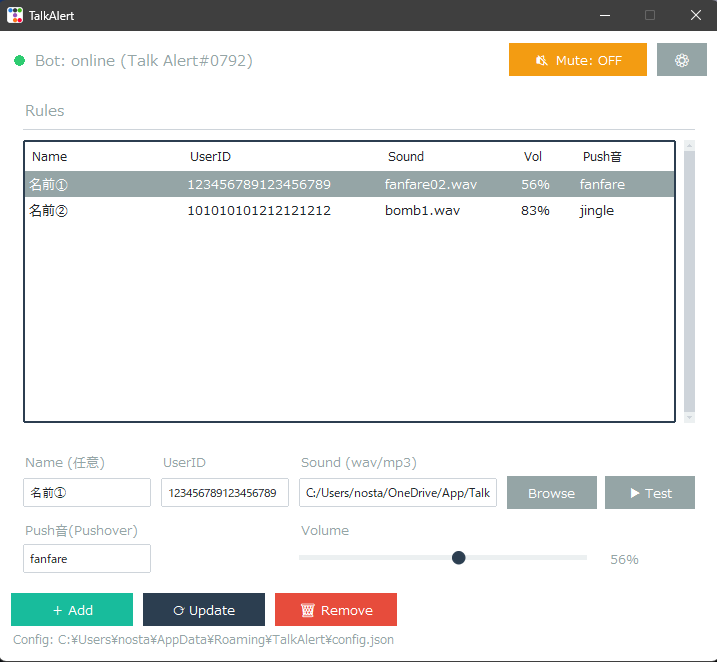

# TalkAlert

指定ユーザーの発言をBOTで監視して音で通知する Discord アラートツール（Windows）

---

## 主な機能
- ユーザーIDごとに 効果音（MP3/WAV） と 音量（0〜100%） を設定
- 最小化で タスクトレイに常駐
- Mute で通知音を無効化
- Pushoverと連携してスマーフォンなどに通知とアラートを送信
---

## 動作環境
- OS: Windows 10 / 11（Microsoft）
- 推奨 Python: 3.11 / 3.12（※ exe 利用者は不要）

---

## 使用方法

### ① Discord Bot を準備する（最初に1回だけ）
1. Discord Developer Portal を開く  
   https://discord.com/developers/applications
2. 右上の「New Application」→ 任意の名前で作成
3. 左メニュー「Bot」→「Add Bot」  
   - すでにBotが作成済みの場合、Add Bot は表示されず Token欄（Copy/Reset）が表示されます  
   - Tokenを作り直したい場合は Reset Token を実行して次へ
4. TOKEN をコピー（※あとでアプリの ⚙ Settings で入力します）
5. 「Privileged Gateway Intents」→「Message Content Intent」を ON
6. 左メニュー「OAuth2」→「URL Generator」
   - Scopes：bot にチェック
   - Bot Permissions：View Channels と Read Message History にチェック
7. 最下部の Generated URL をコピーして開き、TalkAlert を使いたいサーバーへ招待する

---

### ② 監視対象の UserID を調べる
1. Discord の設定 → 詳細設定 → 開発者モード ON
2. 監視したいユーザーを右クリック → ユーザーIDをコピー

---

### ③ アプリの使い方
1. アプリを起動
2. 右上の ⚙ Settings を開く
3. Discord Bot Token を貼り付けて保存  
   - Token はPC内（%APPDATA%\TalkAlert\config.json）に保存されます
4. Rules にルールを追加
   - Name（任意）：メモ（誰か判別用）
   - UserID：監視対象
   - Sound：鳴らす音ファイル（MP3/WAV）
   - Volume：0〜100%
5. 以後、対象ユーザーが発言すると効果音が鳴ります
6. Mute を ON にすると音が鳴らなくなります
---

### Pushoverを使う場合
Pushoverアプリと連携することでスマートフォンでも任意の着信音を鳴らしたり内容が通知できます。  
※Pushoverは1カ月の試用後使い続ける場合、$4.99 USDで購入する必要があります。（買い切りタイプ）  
   1. Pushoverのアカウントを作成し、ログインする。  
   2. 通知を鳴らす端末にPushoverアプリをインストールしログインする。  
   3. DashboardのYour Applications（Create an Application/API Token）  
   4. アプリ名やアイコンを入力して作成。  
   5. API Token/Keyが表示されるのでTalkAlertの設定にそれらを入れる。  
    
任意の音をアップロード  
   1. Dashboardにある Your Custom Sounds セクションから Upload a Sound を選択。  
   2. Name（名前）Description（説明）を入力してMP3ファイルをアップロード。  
   　ここで付けたNameがSoundパラメータに指定する名前になります。  
     
 アップロード条件  
 MP3形式のみ　最大500KB　iOSは30秒を超えると再生されないらしい  
    
--- 
## Discord側の「通常通知音」について
このアプリが音を鳴らしても、Discord本体の通知音が鳴る場合があります。  
不要な場合は Discord 側の通知設定（サーバー/チャンネルのミュート等）で調整してください。

---

## ソースから実行（開発者向け）

### 依存パッケージ（requirements.txt 例）
- discord.py>=2.3
- ttkbootstrap>=1.10
- pystray>=0.19
- Pillow>=10.0
- pygame-ce>=2.4

### インストール（PowerShell）
1. py -m pip install -U pip  
2. py -m pip install -r requirements.txt

### 起動（PowerShell）
- py .\TalkAlert.py

---

## exe をビルドする（Pythonが無いPCへ配布したい場合）

### 推奨：onefolder（安定・配布向き）
onefolder は dist\TalkAlert\ 配下に exe と依存ファイル群が出ます。  
中の _internal 等は実行に必要なので削除しないでください。  
配布は フォルダごとZIP にするのが確実です。

### PowerShell（1行で確実に実行できる形）
1. py -m pip install -U pyinstaller  
2. pyinstaller --noconfirm --clean --windowed --name TalkAlert --icon ".\TalkAlert.ico" --workpath "C:\Temp\TalkAlert_build" --distpath ".\dist" --collect-all ttkbootstrap ".\TalkAlert.py"

### 出力例
- dist\TalkAlert\TalkAlert.exe
- dist\TalkAlert\_internal\...（必要）

### onefile（exe 1個にしたい場合）
- pyinstaller --noconfirm --clean --onefile --windowed --name TalkAlert --icon ".\TalkAlert.ico" --workpath "C:\Temp\TalkAlert_build" --distpath ".\dist" --collect-all ttkbootstrap ".\TalkAlert.py"

---

## SmartScreen について
ビルドした exe は署名していないため、Windows の SmartScreen で「不明な発行元」と表示されることがあります。  
その場合は「詳細情報」→「実行」で起動できます（自己責任で実行してください）。

---

## 設定ファイル
設定は自動保存されます。  
保存先：%APPDATA%\TalkAlert\config.json  
（Rules / Volume / Mute状態 / Token などを保持）

---

## License
MIT
